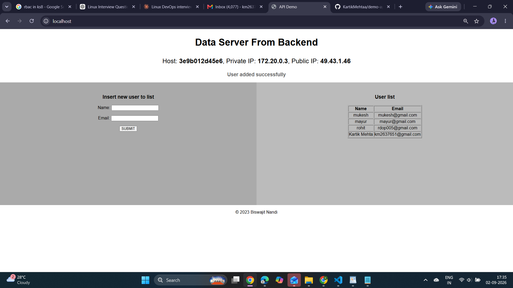

# Node.js Demo App

A simple **Node.js/Express.js** application connected to **MySQL**, containerized using **Docker**, and deployed using **Docker Compose**. Jenkins is used for CI/CD and Nginx acts as a reverse proxy.

[Node.js Demo Application](nodejs-app-demo.jpg)

## Tech Stack

* Node.js / Express.js
* MySQL
* Docker
* Docker Compose
* Nginx
* Jenkins
* SonarQube
* Git / GitHub

## Project Structure

```text
nodejs-demo-app/
├── Dockerfile
├── docker-compose.yaml
├── Jenkinsfile
├── index.js
├── index.html
├── package.json
├── package-lock.json
├── mysql/
│   └── init.sql
├── final-output.png
└── README.md
```

## Architecture

```text
                         GitHub
                            |
                            ↓
                         Jenkins
                            |
                  SonarQube Analysis
                            |
                            ↓
                     Docker Build
                            |
                            ↓
                    Docker Compose
                            |
                            ↓
                       Nginx :80
                   Reverse Proxy
                            |
                            ↓
                    Node.js :5000
                            |
                            ↓
                      MySQL :3306
```

## Run the Application

Build and start the containers:

```bash
docker compose up -d --build
```

Check running containers:

```bash
docker compose ps
```

View logs:

```bash
docker logs node-app
docker logs mysql-db
```

## Application Access

With Nginx reverse proxy:

```text
http://SERVER_IP
```

Node.js runs internally on:

```text
:5000
```

Nginx receives requests on port `80` and forwards them to Node.js.

## MySQL

MySQL data is stored using a Docker volume.

Enter MySQL:

```bash
docker exec -it mysql-db mysql -u appuser -p mydatabase
```

Check the database:

```sql
SHOW TABLES;
SELECT * FROM mycollection;
```

The database table is initialized using:

```text
mysql/init.sql
```

## CI/CD Pipeline

```text
Developer
    ↓
GitHub
    ↓
Jenkins
    ↓
SonarQube
    ↓
Docker Build
    ↓
Docker Compose
    ↓
Nginx
    ↓
Node.js + MySQL
```

Jenkins automates the application build and deployment process.

## Useful Commands

```bash
# Start
docker compose up -d --build

# Stop
docker compose down

# Check containers
docker ps

# Check logs
docker compose logs -f

# Restart
docker compose restart
```

## Security

Do not commit sensitive information such as:

```text
.env
Database passwords
API keys
Private keys
Jenkins credentials
```

Add `.env` and `node_modules/` to `.gitignore`.

## Final Output


